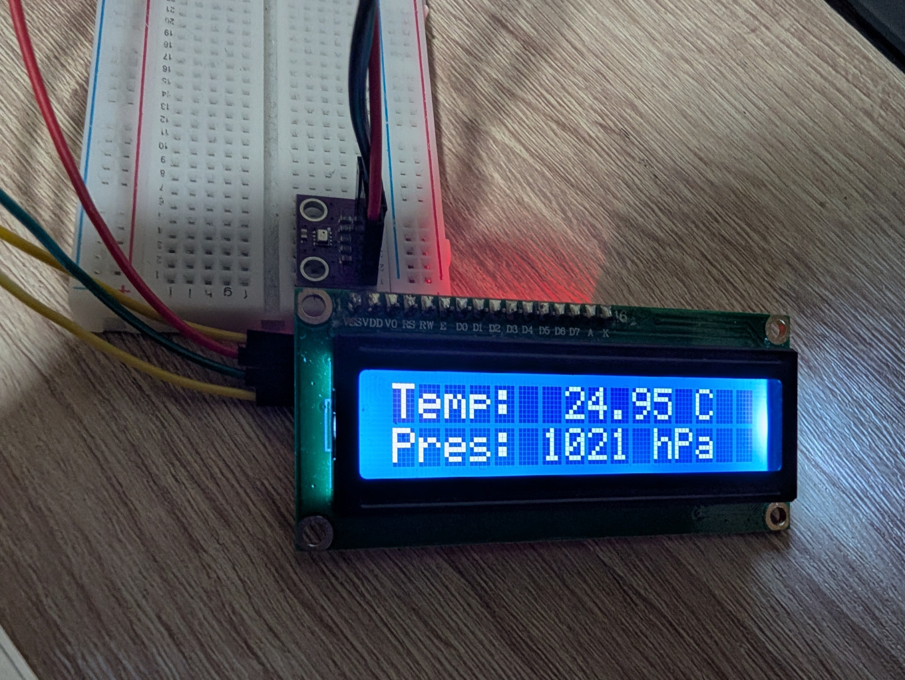
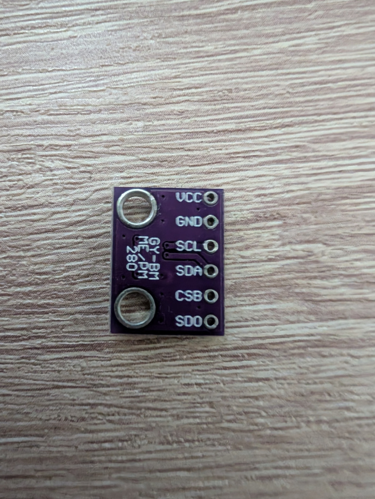
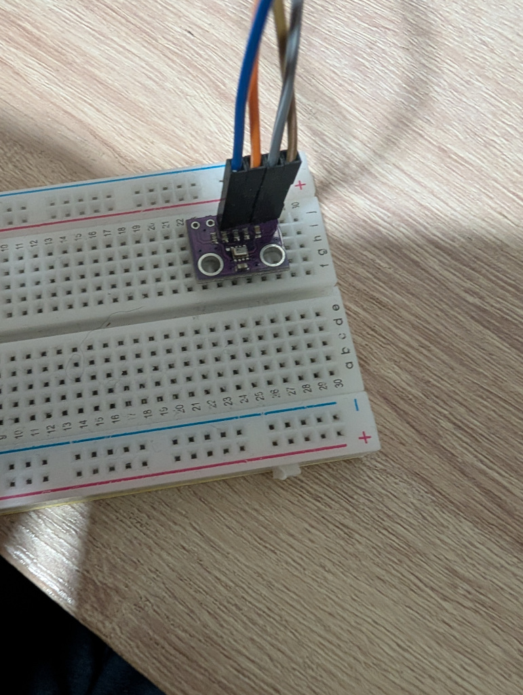
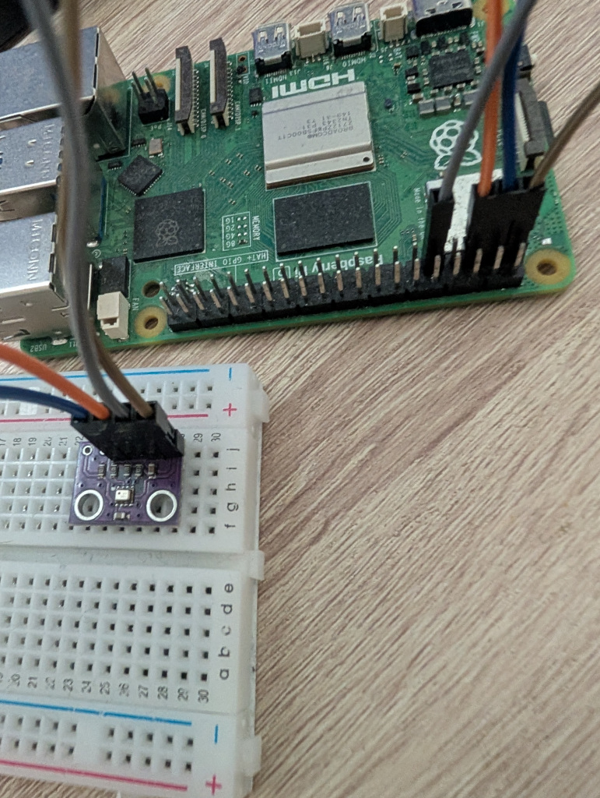

# IIO Compatible Linux Kernel Driver for the BMP280 Temperature and Pressure Sensor

> **Disclaimer:** This is a hobby project I developed after having studied Linux driver development for the past few weeks. I came up with this project as a way to explore concepts such as I2C comunication and the IIO subsystem in practice. In summary, the main purpose of this project is self learning, and it was absolutely **not** tested for "mission critical" use cases. Use it at your own risk.



This project provides a Linux kernel driver for the Bosch BMP280 temperature and pressure sensor. It exposes the sensor data through the Linux IIO (Industrial I/O) subsystem, making it easy to integrate with existing tools and libraries. It also supports IIO triggered buffers. 

This project was designed with full support for Device Tree Overlays, so it can be reconfigured to work on any platform by simply editing the overlay file. That being said, it was only tested on a Raspberry Pi 5, with a BMP280 sensor connected over I2C.

## Overview

The [BMP280](https://www.bosch-sensortec.com/media/boschsensortec/downloads/datasheets/bst-bmp280-ds001.pdf) is a digital barometric pressure and temperature sensor that communicates over either SPI or I2C. This driver specifically supports the **I2C interface**.  It was developed and tested on a Raspberry Pi 5, but should be adaptable to other Linux systems with I2C support by edditing the Device Tree Overlay file.

Instead of a simple character device, this driver uses the [IIO framework](https://docs.kernel.org/driver-api/iio/index.html). This offers several advantages:

* **Standardized Interface:**  IIO provides a consistent way to access sensor data, regardless of the underlying hardware.  Tools that understand IIO can automatically work with this driver.
*   **Sysfs Integration:** Sensor readings and configuration options are exposed through the sysfs filesystem, making them easily accessible from userspace.
* **Data Buffering:** IIO supports data buffering, which can be useful for applications that need to collect data at high frequencies.
* **Trigger Support:**  The IIO framework allows setting up triggers, often used in combination with data buffers. Triggers are events that cause the driver to read a sample of data and push it into a data buffer.

I also wrote another module for a monitor driver that queries the temperature and pressure values using the in-kernel IIO consumer interface, and prints them to a [Hitachi HD44780](https://cdn.sparkfun.com/assets/9/5/f/7/b/HD44780.pdf) character LCD display, as shown in the opening image. For information on this, check out the [LCD Monitor](#lcd-monitor) section below.

## Prerequisites

### **Raspberry Pi and Accessories**
Tested only on Raspberry Pi 5, although it should work on other platforms if you are familiar enough with that platform's Device Tree. You will also need a breadboard and four male to female jumper wires.

### **BMP280 Sensor**

You can easily find it online. It should look something like this:



We will use the I2C protocol, so we will only use the pins labeled SDA (that's the data line), SCL (clock), VCC (3.3v power), and GND (ground). If your BMP280 does not come with soldered pins, I found I could get away by just pinning it down into a breadboard with the male side of the jumper wires.



Ensure it's properly connected to your Raspberry Pi's I2C-1 bus. These should be the GPIO2 pin for data, and GPIO3 pin for clock. Note that there is an I2C-0 bus as well (GPIO0 and GPIO1), but that is typically reserved for the system. You can find more information on [this page](https://pinout.xyz/pinout/i2c). You also need pins for 3.3v power and ground. My arrangement looks like this:



## System Setup

* **I2C Enabled:** Make sure I2C is enabled on your Raspberry Pi. You can do this using `sudo raspi-config` (Interface Options -> I2C -> Enable) or by manually editing `/boot/firmware/config.txt` and ensuring `dtparam=i2c_arm=on` is present (and not commented out). Reboot after enabling.

* **`i2c-dev` module**: This is useful in order to make sure you wired up your sensor the right way. The `i2c-dev` kernel module gives userspace access to I2C. For each I2C bus on the system, this module exposes a `/dev/i2c-X` chrdev file. It comes with Raspberry Pi OS, and you can load it with:

	```bash
    sudo modprobe i2c-dev
    ```

	To make it load automatically on boot, add `i2c-dev` to `/etc/modules`. On my installation, it's already there.

	For our example, after enabling the bus and loading this module, you should have an `/dev/i2c-1` file.

* **`i2c-tools`**: The i2c-tools package provides a set of command-line utilities that make it easier to communicate with I2C devices from userspace using the `i2c-dev` exposed files. You can install it on Raspberry Pi OS using:

	```bash
	sudo apt install i2c-tools
	```

	If you wired everything correctly, running `i2cdetect -l` will display all the I2C buses on the system. The main bus exposed through the GPIO pins should show up as `i2c-1`. If not, you probably didn't enable it (see above), or didn't reboot after enabling it.

	Finally, running `i2cdetect -y 1` will show a table of devices sitting on our I2C bus. There should only be one filled entry in this table, with the address number associated with our BMP280 sensor. For instance, my sensor has address 0x76. Take note of this number.

## Building the Driver

1. **Linux Kernel Headers:** You will need the kernel headers for your running kernel. Install them using:

	```bash
    sudo apt install raspberrypi-kernel-headers
    ```

	You should have a directory with your kernel headers and config files at `/usr/lib/modules/$(uname -r)/build`. This is enough to build modules, we don't need the full kernel sources.

2. **Build Dependencies:** You will need a set of dependencies to build kernel modules and device tree overlays. On the Raspberry Pi OS, you can install them with:

	```bash
	sudo apt install git make build-essential device-tree-compiler
	```

3. **Clone the Repository:**

    ```bash
    git clone https://github.com/Leonardo-Blanger/bmp280-iio.git
    cd bmp280-iio
    ```

4. **Build the Device Tree Overlay:**

	```bash
	make dtbo
	```
	This will generate our `bmp280-iio.dtbo` Device Tree blob overlay.

5. **Build the Module:**

    ```bash
    make modules
    ```
    This will generate our `bmp280-iio.ko` kernel module.

	Note: Running `make` withou arguments builds both the DT overlay, and the module. Running `make clean` deletes all build files from the repo.

## Installing and Loading the Driver

1. **Copy the Module and Overlay to system wide directories (Optional but Recommended):**

	```bash
	sudo cp bmp280-iio.dtbo /boot/firmware/overlays
	```
	This will place your DT overlay in the system's default overlay directory.

    ```bash
    sudo make modules_install
    ```
    This will place your module in the correct kernel modules directory. You might need to manually run `sudo depmod` afterwards. For some reason, on my installation, it does not run automatically.

1. **Load the DT Overlay**

	```bash
	sudo dtoverlay bmp280-iio.dtbo
	```
	You can omit the `.dtbo` extension if copied it to your system's overlay directory. If you now run `dtoverlay -l`, you should be able to see our overlay listed. You can also use `sudo dtoverlay -r bmp280-iio` to unload it.

	In case your sensor had a different I2C address, you can override it on the overlay when loading.

	```bash
	sudo dtoverlay bmp280-iio.dtbo address=<your sensor I2C address>
	```
	You could also achieve this by replacing `0x76` in `bmp280-iio.dts` with your sensor address before compiling.

1. **Load the Module:**

	The IIO subsystem is also shipped as a set of modules on Raspberry Pi OS. You can load our main dependencies with:

	```bash
	sudo modprobe industrialio
	sudo modprobe industrialio-triggered-buffer
	```

	And then load our module with:

    ```bash
    sudo insmod bmp280-iio.ko
    ```

	In case your sensor had a different I2C address, you can override it when loading the module.

	```bash
	sudo insmod bmp280-iio.ko bmp280_i2c_address=<your sensor I2C address>
	```

    Alternatively, if you used `make modules_install`, you can load it with:

    ```bash
    sudo modprobe bmp280-iio [bmp280_i2c_address=<your sensor I2C address>]
    ```

	The dependency modules above are loaded automatically if you used `make modules_install`.

	If you now run `lsmod | head`, you should be able to see our loaded `bmp280-iio` module listed at the top of the list. You can use `sudo rmmod bmp280-iio` (or `sudo modprobe -r bmp280-iio`) to unload it.

1. **Verify Installation:**

	* Check for the IIO device:

		```bash
		ls /sys/bus/iio/devices/
		```
		You should see a device named something like `iio:deviceX` (where X is a number). This represents your BMP280 sensor. You can check for the device name using:

		```bash
		cat '/sys/bus/iio/devices/iio:device<X>/name'
		```
		The name should be `bmp280-iio`. This is useful in case you already had other IIO device directories.

	* Check for kernel messages:

		```bash
		dmesg | grep bmp280_iio
		```
		You should see the following messages indicating the driver loaded and detected the sensor:

		```
		[...] bmp280_iio: loading out-of-tree module taints kernel.
		[...] bmp280_iio: Probing the i2c driver.
		[...] bmp280_iio: Probed i2c driver successfully.
		```

1. **Automatic Loading on Boot (Optional):**

	* To automatically load the driver on boot, make sure you installed the module on the correct system directory with `sudo make modules_install`, and then add `bmp280-iio` to the `/etc/modules` file. Again, in this case, the dependency modules mentioned above are loaded automatically.

	* To automatically load our DT overlay on boot, in addition to have it in your system wide `/boot/firmware/overlays` folder, you also need to add the overlay directive `dtoverlay=bmp280-iio` to the end of `/boot/firmware/config.txt`.

## Accessing Sensor Data

After the driver is loaded, the sensor data will be available through the IIO sysfs interface. You can find the data under `/sys/bus/iio/devices/iio:deviceX/`, where `X` is some number, depending on how many IIO devices you have loaded.

The important files are:

* `in_temp0_raw` to `in_temp2_raw`: Raw temperature calibration readings.
* `in_temp3_raw`: Raw temperature reading. Its meaning depends on the calibration values.
* `in_pressure0_raw` to `in_pressure8_raw`: Raw pressure calibration readings.
* `in_pressure9_raw`: Raw pressure reading. It's meaning depends on the calibration values.
* `in_temp_input`: This is the final, processed temperature value, in degrees Celcius.
* `in_pressure_input`: This is the final, processed pressure value, in Pascal.

### Example

``` bash
$ cat /sys/bus/iio/devices/iio:device0/name
bmp280-iio

$ cat /sys/bus/iio/devices/iio:device0/in_temp_input
20.960000000

$ cat /sys/bus/iio/devices/iio:device0/in_pressure_input
101422.062500000
```

The sensor tells me that it reads 20.96 C, and ~1014 hPa on my room.

## IIO Triggered Buffer Capture

This driver supports IIO triggered buffers, allowing you to capture sensor data at a specified rate, or triggered by certain events. This is more efficient than repeatedly reading the above mentioned files.

When using triggered buffers, note that the final temperature and pressure values are not scaled like the ones we get by reading `sysfs` channel files directly. The temperature is returned in units of 1/100 degrees Celcius, while the pressure is returned in units of 1/256 Pascal, so make sure to divide them by 100 and 256, respectively, before interpreting them. You can read the comments in `src/bmp280.h` for more details.

**Note:** You might face permission issues when trying to write to some of the sysfs files mentioned in this section, even when running commands with sudo. You can get around this issue by either switching to a root shell (not recommended), with `sudo su`, or by running your commands using bash "command string" mode, and then invoking bash as sudo. E.g:

``` bash
sudo bash -c '<your original command here>'
```

### Setting up the Trigger

IIO supports several different types of trigger. Common types include:

* **hrtimer triggers:** Based on high resolution timers. Can be used to trigger capture at regular time intervals.

* **sysfstrig:** A software trigger controlled through sysfs. This allows you to manually configure and trigger data capture by writing to specific sysfs files.

#### Using hrtimer (Example):

Load the `iio-trig-hrtimer` module (or list it on `/etc/modules` so it loads on boot):

``` bash
sudo modprobe iio-trig-hrtimer
```

We create an hrtimer trigger by creating a sysfs directory, like this:

``` bash
mkdir /sys/kernel/config/iio/triggers/hrtimer/my-trigger
```

You should now see a new trigger (e.g., `triggerY`) in `/sys/bus/iio/devices`, where `Y` is some number.

Next, set the sampling frequency (in nanoseconds). For 50 Hz:

``` bash
echo 50 > /sys/bus/iio/devices/trigger0/sampling_frequency
```

You can remove the trigger by removing the sysfs directory created earlier:

``` bash
rm -r /sys/kernel/config/iio/triggers/hrtimer/my-trigger
```

#### Using sysfstrig (Example):

Load the `iio-trig-sysfs` module (or list it on `/etc/modules` so it loads on boot):

``` bash
sudo modprobe iio-trig-sysfs
```

To create a sysfs trigger, write a number to the following sysfs file:

``` bash
echo 0 > /sys/bus/iio/devices/iio_sysfs_trigger/add_trigger
```

You should see a new trigger, (e.g., `triggerY`) `/sys/bus/iio/devices`, where `Y` is the number you wrote. You can then trigger a buffer capture at any time:

``` bash
echo 1 > /sys/bus/iio/devices/trigger0/trigger_now
```

You can remove the trigger by writing the same number `Y` to this sysfs file:

``` bash
echo 0 > /sys/bus/iio/devices/iio_sysfs_trigger/remove_trigger
```

### Associating the Trigger with our Device

Regardless of the trigger type, you associate it with the our device by writting it's name attribute to our device's `trigger/current_trigger`.

``` bash
cat /sys/bus/iio/devices/trigger0/name > /sys/bus/iio/devices/iio:device0/trigger/current_trigger
```

You can disassociate the trigger from the device by writting an empty string to the same file.

``` bash
echo "" > /sys/bus/iio/devices/iio:device0/trigger/current_trigger
```

### Configuring the Device Buffer

You control which channels are captured using files in your device's `scan_elements` folder. Write any non zero value to the `scan_elements/*_en` files to enable the respective channels, or 0 to disable them.

Enable the channels you want to capture. For instance, to enable processed (final) temperature and pressure values, run:

``` bash
echo 1 > /sys/bus/iio/devices/iio:device0/scan_elements/in_temp_en
echo 1 > /sys/bus/iio/devices/iio:device0/scan_elements/in_pressure_en
```

You can also check other buffer configurations inside `scan_elements`. Reading from `scan_elements/*_index` returns the index of channels in the capture. The captured data from enabled channels is written into the buffer sorted by this index. For instance, for our two enabled channels:

``` bash
$ cat /sys/bus/iio/devices/iio:device0/scan_elements/in_temp_index
4

$ cat /sys/bus/iio/devices/iio:device0/scan_elements/in_pressure_index
15
```

This means the final temperature is stored first on the buffer, followed by the final pressure.

Reading from `scan_elements/*_type` returns the format that the captured data for each channel is stored in the buffer. For instance:

``` bash
$ cat /sys/bus/iio/devices/iio:device0/scan_elements/in_temp_type 
le:s32/32>>0

$ cat /sys/bus/iio/devices/iio:device0/scan_elements/in_pressure_type 
le:u32/32>>0
```

You interpret this as: Little Endian data (`le`), signed/unsigned (`s`/`u`), taking a payload of `32` bits, out of a `32` bits field, requiring no right bit shift (`>>0`).

### Triggering a Data Capture

Set the buffer size. This is the number of samples that will fit in the buffer before you must read older samples. For instance:

``` bash
echo 100 > /sys/bus/iio/devices/iio:device0/buffer/length
```

Enable the buffer:

``` bash
echo 1 > /sys/bus/iio/devices/iio:device0/buffer/enable
```

If you are using hrtimers, data is already being captured at the specified frequency. If you are using a sysfs manual trigger, you can trigger a capture with (run it as many times as you want samples):

``` bash
echo 1 > /sys/bus/iio/devices/trigger0/trigger_now
```

Disable the buffer:

``` bash
echo 0 > /sys/bus/iio/devices/iio:device0/buffer/enable
```

### Reading from the Buffer

You can access the captured data by reading from your device's `/dev` endpoint. You can do that either while samples are pushed into the buffer, as well as after the buffer is disabled. You can use `hexdump` to quickly visualize the data. For instance, with our buffer configuration, after triggering the capture 4 times, we have:

``` bash
$ cat /dev/iio:device0 | hexdump
0000000 07f1 0000 e433 018f 07f1 0000 e750 018f
0000010 07f0 0000 e595 018f 07f1 0000 e478 018f
```

`hexdump` will only print a new line every 16 new bytes, and the first number it prints on each line is the offset for the current read. Notice that our temperature and pressure are 32 bit fields (`scan_elements/*_type`, see above), so triggering 4 captures gives us two rows of data. `hexdump` by default prints a hexadecimal reading for each group of two consecutive bytes.

From `scan_elements/in_temp_type`, we have that our final temperature type string is `le:s32/32>>0`. This means it takes up 32 bits, or 2 consecutive groups above, so the first temperature value is `07f1 0000`. Since this is Little Endian, you should read the groups in reverse, i.e. `000007f1`, or 2033. After dividing by 100, we have that the first temperature reading is 20.33 C. With a similar reasoning, the first pressure value (`e433 018f`), is interpreted as 26207283/256, or ~1023.72 hecto-Pascal.

A note on padding. Depending on the size of the channels you select, the IIO subsystem might pad each sample with zero bytes at the end. I believe it does this to have captured samples cache aligned, or some other performance reason. On my system, it seems to always make the sample size a multiple of 4 bytes. Before using this buffered data, you should make sure you know how much padding each sample has. You can do that by comparing how many bytes you have per sample, with how many you expect to have from the `scan_elements/*_type` strings.

## LCD Monitor

I implemented a second module uses the in-kernel IIO consumer interface to query the processed temperature and pressure values, and print them to a [Hitachi HD44780](https://cdn.sparkfun.com/assets/9/5/f/7/b/HD44780.pdf) character LCD display.


This module is called `bmp280-hd44780-monitor`, and the sources are in the `lcd-monitor` directory. It depends on our main `bmp280-iio` module, as well as another driver I wrote, for the HD44780 display, available on [this repo](https://github.com/Leonardo-Blanger/hd44780). Please, follow the README instructions on that repository to set up and use the HD44780 display. After you have both drivers, `bmp280-iio` and `hd44780`, built and loaded, proceed with the following instructions.

1. **Build the module and device tree overlay.** For this, you will need to tell the build system about the exported symbol table for the dependency `hd44780` module. These are in the `Module.symvers` file, created on the root of the hd44780 project after you build it.

   ``` bash
   cd lcd-monitor
   make HD44780_ROOT=/absolute/path/to/built/hd44780/repo
   ```

   This will generate the `.dtbo` device tree overlay file, and the `.ko` kernel module.

1. **Load the overlay and module.**

   ``` bash
   sudo dtoverlay bmp280-hd44780-monitor.dtbo
   sudo insmod bmp280-hd44780-monitor.ko
   ```

   If you want, you can perform the same instructions as for the main `bmp280-iio` module, to have these installed system-wide and/or loaded during boot.

   From now on, the monitor driver should already be running and updating your display periodically.

1. **Runtime configuration.** I created three sysfs attribute files to control the monitor driver during runtime. These will be in the driver sysfs directory. Since this is a platform driver, the path is:

   ``` bash
   /sys/bus/platform/drivers/bmp280-hd44780-monitor/leonardo_bmp280_hd44780_monitor
   ```

   You can read and write to all three files. The files are:

   * `monitor_display_index`: This attribute controls which hd44780 display instance we write our data to. All default overlays in the hd44780 repo have this index set to zero, which is the default for this attribute. Unless you have more than one display, or for some reason changed the display index in the device tree, you do not need to change this.
   * `monitor_running`: This is a boolean attribute, any number different than 0 means to run the monitor driver. Defaults to 1.
   * `monitor_refresh_period_ms`: How often does the driver queries the values from the sensor over IIO, and writes them to the display. Defaults to 2000 ms (2 seconds).

## License

This project is licensed under the GPLv2 License - see the LICENSE file for details.

## References

Some resources I found useful as I was learning about these topics:

* The [BMP280 Datasheet](https://www.bosch-sensortec.com/media/boschsensortec/downloads/datasheets/bst-bmp280-ds001.pdf).

* *Linux Kernel Programming - Second Edition*, by Kaiwan N. Billimoria, 2024.

	The best resource I came across about the Linux Kernel. It's a long and very thorough technical read, but absolutely worth it. It's also very up to date, with a 2024 edition. Recomended for anyone wanting to start learning about the Linux Kernel.

* *Linux Kernel Programming Part 2 - Char Device Drivers and Kernel Synchronization*, by Kaiwan N. Billimoria, 2021.

	A companion to the previous book, by the same author. Goes into more depth about some aspects of the kernel that come up often when working with drivers.

* *Linux Device Driver Development - Second Edition*, by John Madieu, 2022.

	Great book with a focus on driver development, with very detailed chapters on I2C and the IIO subsystem.

* The [Johannes 4GNU_Linux](https://www.youtube.com/@johannes4gnu_linux96) Youtube channel.

	This channel has a great playlist about driver development, and it's where I got the idea of writing a driver for the BMP280 as an excercise.
